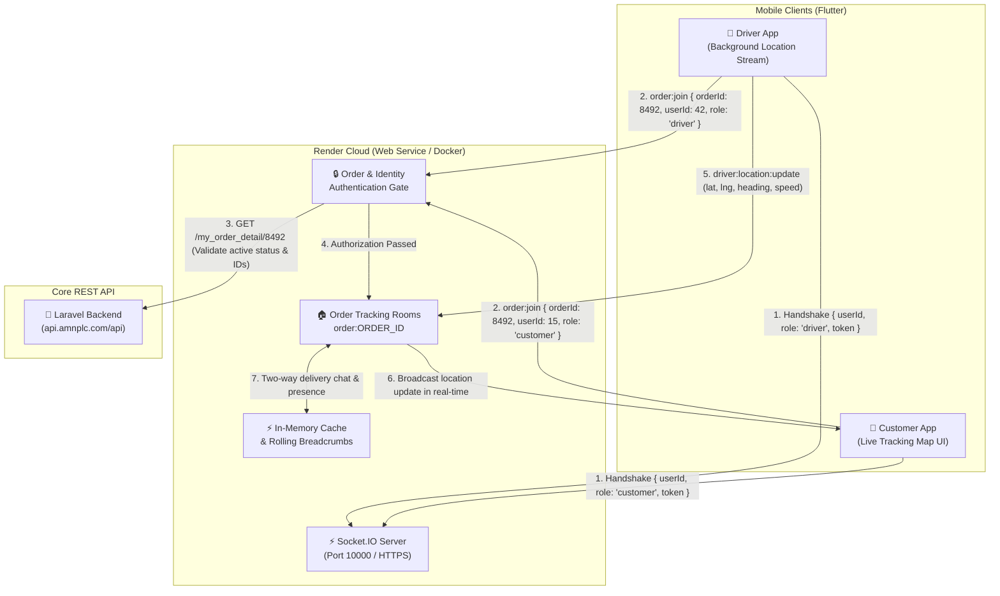

# 🚀 AMN Delivery Real-Time Socket Server

An enterprise-grade, modular, real-time location tracking and peer-to-peer delivery communication server powered by **Node.js**, **TypeScript**, and **Socket.IO (v4)**. Built specifically for seamless, production-ready deployment on **Render**.

---

## 📋 Table of Contents

- [Architectural Overview](#-architectural-overview)
- [Security & Authentication Gate](#-security--authentication-gate)
- [Project Structure](#-project-structure)
- [Socket.IO Protocol & Event Reference](#-socketio-protocol--event-reference)
- [Deploying to Render](#-deploying-to-render)
- [Environment Variables](#-environment-variables)
- [Flutter Client Integration (Driver & Customer Apps)](#-flutter-client-integration)
- [Local Development & Testing](#-local-development--testing)
- [Health & Monitoring Endpoints](#-health--monitoring-endpoints)

---

## 🏛️ Architectural Overview



---

## 🔒 Security & Authentication Gate

This server enforces strict **zero-trust identity & active order status gating** before permitting any real-time tracking or communication:

1. **Active Order Status Check**:
   - Queries `GET /my_order_detail/{orderId}` from the backend REST API (cached for 30s to prevent backend exhaustion).
   - Verifies the order status is currently in an active delivery state (`'1'`, `'2'`, `'3'`, `'assigned'`, `'heading_to_store'`, `'order_picked_up'`, `'heading_to_customer'`, `'arrived'`).
   - If the order is already `'delivered'`, `'cancelled'`, or non-existent, the request is immediately rejected with `ORDER_INACTIVE` or `ORDER_NOT_FOUND`.

2. **Role & Identity Matching**:
   - **Drivers**: The connecting driver's `userId` must strictly match the assigned `driver_id` on the order record. If an unauthorized driver attempts to join or broadcast location, access is rejected with `DRIVER_MISMATCH`.
   - **Customers**: The connecting customer's `userId` must strictly match the `customer_id` / `user_id` on the order record. Unauthorized third parties are rejected with `CUSTOMER_MISMATCH`.

3. **Room Isolation**:
   - All location coordinates, status transitions, ETAs, and chat messages are bound strictly to private rooms: `order:<orderId>`.
   - Sockets cannot emit coordinates to orders they have not joined and passed verification for.

---

## 📁 Project Structure

```
delivery-socket-server/
├── Dockerfile                  # Production multi-stage Docker build
├── render.yaml                 # Render Blueprint automated deployment spec
├── package.json                # Dependencies, build scripts & Jest runner
├── tsconfig.json               # Strict TypeScript configuration
├── jest.config.js              # Unit & integration testing configuration
├── .env.example                # Documented configuration template
├── src/
│   ├── app.ts                  # Express setup, /health, /metrics, /api REST endpoints
│   ├── server.ts               # HTTP & Socket.IO initialization, graceful shutdown
│   ├── config/
│   │   ├── constants.ts        # Event names, active statuses, error codes
│   │   └── env.config.ts       # Type-safe Zod environment validation
│   ├── handlers/
│   │   ├── orderRoom.handler.ts# Join/leave room, presence notification
│   │   ├── location.handler.ts # Driver GPS packets & room broadcast
│   │   ├── status.handler.ts   # Order workflow status transitions & ETA
│   │   └── chat.handler.ts     # In-delivery driver <-> customer messaging
│   ├── middlewares/
│   │   ├── socketAuth.middleware.ts # Handshake token & user context
│   │   └── validators.ts       # Zod runtime schema validators
│   ├── services/
│   │   ├── order.service.ts    # REST backend order verification & cache
│   │   ├── tracking.service.ts # In-memory room state, presence & breadcrumbs
│   │   └── logger.service.ts   # Structured JSON / formatted logging
│   └── types/
│       ├── order.types.ts      # ActiveOrder, LocationPayload, EtaPayload
│       ├── socket.types.ts     # Typed ClientToServerEvents & ServerToClientEvents
│       └── error.types.ts      # SocketErrorPayload & exceptions
└── tests/
    ├── health.test.ts          # Express routes & Render health probe tests
    └── orderTracking.test.ts   # Comprehensive Socket.IO authentication & tracking tests
```

---

## 📡 Socket.IO Protocol & Event Reference

### 1. Client to Server Events (Emitted by Apps)

| Event | Sender | Payload | Description |
| :--- | :--- | :--- | :--- |
| `order:join` | Driver / Customer | `{ orderId, userId, role, token? }` | Authenticates and joins tracking room for an active order. |
| `order:leave` | Driver / Customer | `{ orderId, userId }` | Leaves the order room. |
| `driver:location:update` | Driver Only | `{ orderId, latitude, longitude, heading?, speed?, accuracy?, timestamp }` | Broadcasts driver's GPS location. |
| `driver:eta:update` | Driver Only | `{ orderId, estimatedMinutes, remainingDistanceMeters?, polyline? }` | Updates estimated arrival time. |
| `order:status:update` | Driver / Admin | `{ orderId, status, statusName?, notes?, timestamp }` | Updates delivery status (e.g. `'order_picked_up'`, `'arrived'`). |
| `order:message:send` | Driver / Customer | `{ orderId, senderId, senderRole, senderName?, message, timestamp }` | Sends peer-to-peer delivery message. |
| `ping` | Any | `callback?` | Heartbeat keep-alive ping. |

### 2. Server to Client Events (Received by Apps)

| Event | Receiver | Payload | Description |
| :--- | :--- | :--- | :--- |
| `order:joined` | Joining Socket | `{ success, orderId, role, order, lastKnownLocation?, lastEta?, peerConnected }` | Emitted upon successful authentication. Returns cached last known location immediately. |
| `order:peer:joined` | Order Room Peers | `{ orderId, userId, role, timestamp }` | Notifies that the other party (driver/customer) is now online. |
| `order:peer:left` | Order Room Peers | `{ orderId, userId, role, timestamp }` | Notifies that the other party has left or disconnected. |
| `driver:location:update` | Customer in Room | `{ orderId, latitude, longitude, heading, speed, accuracy, timestamp }` | Live GPS coordinate stream for map marker updates. |
| `driver:eta:update` | Customer in Room | `{ orderId, estimatedMinutes, remainingDistanceMeters?, polyline? }` | Real-time ETA update. |
| `order:status:update` | Order Room | `{ orderId, status, statusName?, notes?, timestamp }` | Status transition notification. |
| `order:completed` | Order Room | `{ orderId, status, timestamp }` | Emitted when order reaches terminal status (`'delivered'`). Room closes after grace period. |
| `order:message:received` | Order Room | `{ messageId, orderId, senderId, senderRole, senderName?, message, timestamp }` | Chat message delivered. |
| `order:error` | Calling Socket | `{ code, message, orderId?, details? }` | Emitted whenever an authentication, validation, or permission error occurs. |
| `pong` | Calling Socket | `void` | Heartbeat response. |

### 3. Error Codes (`order:error`)

- `DRIVER_MISMATCH`: The user's ID does not match the driver assigned to this order.
- `CUSTOMER_MISMATCH`: The user's ID does not match the customer who placed this order.
- `ORDER_INACTIVE`: The order is delivered, cancelled, or not in an active tracking state.
- `ORDER_NOT_FOUND`: The order ID could not be found or verified against the backend.
- `UNAUTHORIZED`: General authentication failure or socket missing permissions.
- `INVALID_PAYLOAD`: Malformed event payload (schema validation failed).

---

## 🌐 Deploying to Render

This repository includes a ready-to-deploy [`render.yaml`](file:///c:/flutter_dev/projects/delivery-socket-server/render.yaml) blueprint and a multi-stage [`Dockerfile`](file:///c:/flutter_dev/projects/delivery-socket-server/Dockerfile).

### Option 1: Automated Blueprint Deploy (Recommended)

1. Push this repository to GitHub or GitLab:
   ```bash
   git remote add origin https://github.com/YOUR_ORG/delivery-socket-server.git
   git branch -M main
   git push -u origin main
   ```
2. Log into [Render Dashboard](https://dashboard.render.com).
3. Click **New +** $\rightarrow$ **Blueprint**.
4. Select your `delivery-socket-server` repository.
5. Render automatically reads `render.yaml`, configures the health check path (`/health`), sets default environment variables, and deploys your Web Service!

### Option 2: Manual Web Service Creation

1. Click **New +** $\rightarrow$ **Web Service**.
2. Connect your Git repository.
3. Configure the following settings:
   - **Name**: `amn-delivery-socket-server`
   - **Environment**: `Node`
   - **Region**: `Frankfurt` (or closest to your users)
   - **Branch**: `main`
   - **Build Command**: `npm install && npm run build`
   - **Start Command**: `npm run start`
   - **Health Check Path**: `/health`
4. Add the Environment Variables (see table below).
5. Click **Create Web Service**. Render will assign an automatic HTTPS URL:
   `https://amn-delivery-socket-server.onrender.com`

---

## ⚙️ Environment Variables

| Variable | Default Value | Description |
| :--- | :--- | :--- |
| `PORT` | `10000` | Port automatically assigned by Render. |
| `HOST` | `0.0.0.0` | Host binding interface. Must be `0.0.0.0` on Render. |
| `NODE_ENV` | `production` | Environment mode (`development`, `production`, `test`). |
| `CORS_ORIGIN` | `*` | Allowed CORS origins (e.g. `*` or `https://app.amnplc.com`). |
| `BACKEND_API_BASE_URL` | `https://api.amnplc.com/api` | REST backend URL for order & profile verification. |
| `BACKEND_API_KEY` | *(optional)* | Secret token for server-to-server requests to Laravel API. |
| `VALIDATION_MODE` | `strict` | `strict`: Live REST verification required. `fallback`: Fallback to cache/mock if backend down. |
| `ORDER_CACHE_TTL_SECONDS` | `30` | In-memory cache TTL for order validation queries. |
| `MAX_LOCATION_HISTORY` | `100` | Max rolling GPS breadcrumbs kept per active order. |
| `SOCKET_PING_INTERVAL_MS`| `25000` | Socket.IO ping interval (ms). |
| `SOCKET_PING_TIMEOUT_MS` | `20000` | Socket.IO connection timeout threshold (ms). |

---

## 📱 Flutter Client Integration

Add `socket_io_client` to `pubspec.yaml`:
```yaml
dependencies:
  socket_io_client: ^3.0.2
```

### 1. Driver App (`driver_app`) Integration

```dart
import 'package:socket_io_client/socket_io_client.dart' as IO;

class DriverLocationSocketService {
  late IO.Socket socket;
  final String socketServerUrl = 'https://amn-delivery-socket-server.onrender.com';

  void connectAndTrackOrder({
    required String orderId,
    required String driverId,
    required String authToken,
  }) {
    // 1. Establish socket connection with handshake authentication
    socket = IO.io(
      socketServerUrl,
      IO.OptionBuilder()
          .setTransports(['websocket', 'polling'])
          .setAuth({'userId': driverId, 'role': 'driver', 'token': authToken})
          .enableAutoConnect()
          .build(),
    );

    socket.onConnect((_) {
      print('Connected to Socket Server. Requesting order join...');

      // 2. Authenticate and join order tracking room
      socket.emitWithAck('order:join', {
        'orderId': orderId,
        'userId': driverId,
        'role': 'driver',
      }, ack: (response) {
        if (response['success'] == true) {
          print('✅ Successfully authenticated for Order #$orderId');
        } else {
          print('⛔ Join error: ${response['error']}');
        }
      });
    });

    // 3. Listen for customer presence
    socket.on('order:peer:joined', (data) {
      print('Customer is now online tracking your vehicle');
    });

    // 4. Handle authentication / inactive errors
    socket.on('order:error', (error) {
      print('Socket Error [${error['code']}]: ${error['message']}');
    });
  }

  /// 5. Stream GPS coordinates from Geolocator / Location stream
  void sendLocationUpdate({
    required String orderId,
    required double latitude,
    required double longitude,
    double? heading,
    double? speed,
    double? accuracy,
  }) {
    if (socket.connected) {
      socket.emit('driver:location:update', {
        'orderId': orderId,
        'latitude': latitude,
        'longitude': longitude,
        'heading': heading ?? 0.0,
        'speed': speed ?? 0.0,
        'accuracy': accuracy ?? 5.0,
        'timestamp': DateTime.now().millisecondsSinceEpoch,
      });
    }
  }

  void disconnect() {
    socket.disconnect();
    socket.dispose();
  }
}
```

### 2. Customer App (`delivery_app`) Integration

```dart
import 'package:socket_io_client/socket_io_client.dart' as IO;

class CustomerTrackingSocketService {
  late IO.Socket socket;
  final String socketServerUrl = 'https://amn-delivery-socket-server.onrender.com';

  void startTrackingOrder({
    required String orderId,
    required String customerId,
    required String authToken,
    required Function(double lat, double lng, double heading) onLocationReceived,
    required Function(int etaMinutes) onEtaReceived,
  }) {
    socket = IO.io(
      socketServerUrl,
      IO.OptionBuilder()
          .setTransports(['websocket', 'polling'])
          .setAuth({'userId': customerId, 'role': 'customer', 'token': authToken})
          .enableAutoConnect()
          .build(),
    );

    socket.onConnect((_) {
      // 1. Join room and retrieve initial cached position
      socket.emitWithAck('order:join', {
        'orderId': orderId,
        'userId': customerId,
        'role': 'customer',
      }, ack: (response) {
        if (response['success'] == true) {
          final lastLoc = response['data']?['lastKnownLocation'];
          if (lastLoc != null) {
            onLocationReceived(
              (lastLoc['latitude'] as num).toDouble(),
              (lastLoc['longitude'] as num).toDouble(),
              (lastLoc['heading'] as num?)?.toDouble() ?? 0.0,
            );
          }
        }
      });
    });

    // 2. Receive live location updates from the driver in real-time
    socket.on('driver:location:update', (data) {
      final lat = (data['latitude'] as num).toDouble();
      final lng = (data['longitude'] as num).toDouble();
      final heading = (data['heading'] as num?)?.toDouble() ?? 0.0;
      onLocationReceived(lat, lng, heading);
    });

    // 3. Receive live ETA
    socket.on('driver:eta:update', (data) {
      final eta = (data['estimatedMinutes'] as num).toInt();
      onEtaReceived(eta);
    });

    // 4. Order completed
    socket.on('order:completed', (data) {
      print('Order delivered! Cleaning up tracking.');
      disconnect();
    });
  }

  void disconnect() {
    socket.disconnect();
    socket.dispose();
  }
}
```

---

## 💻 Local Development & Testing

### 1. Prerequisites
- Node.js >= 18.0.0
- npm >= 9.0.0

### 2. Setup
```bash
# Clone or navigate into directory
cd delivery-socket-server

# Install dependencies
npm install

# Copy environment variables
cp .env.example .env
```

### 3. Running in Development Mode
```bash
npm run dev
# Starts server with ts-node-dev auto-reloading on port 10000
```

### 4. Running the Test Suite
```bash
npm test
# Executes Jest test suite (15 unit and integration tests)
```

### 5. Production Build
```bash
npm run build
npm start
```

---

## 🏥 Health & Monitoring Endpoints

| Endpoint | Method | Description |
| :--- | :--- | :--- |
| `/health` | `GET` | **Render Health Check Probe**. Returns HTTP 200 with uptime, memory stats, and active tracking rooms. |
| `/` | `GET` | Service information, version, and server status. |
| `/metrics` | `GET` | Operational metrics (active room count, participants, memory usage). |
| `/api/orders/:id/tracking` | `GET` | REST inspection of current tracking state, participant count, and last known coordinates. |
| `/api/orders/mock` | `POST` | Registers a test order in development/fallback mode. |

---

## 📄 License

MIT License. Designed and engineered for AMN Delivery Tech Operations.
